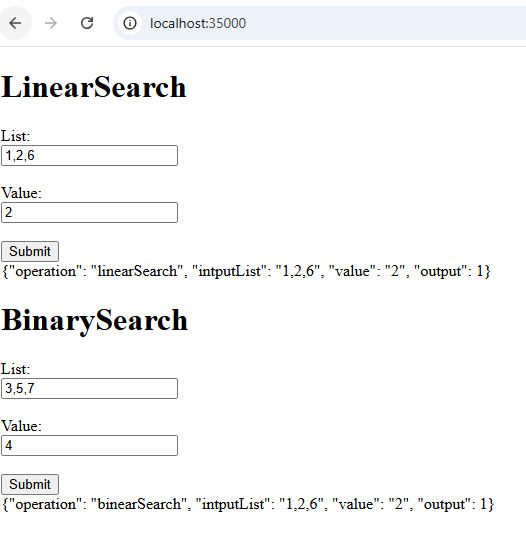

### PARCIAL 2 CORTE- AREP

Este proyecto consiste en un sistema de microservicios que tiene un servicio para computar las funciones de ordenamiento linear Search.  El servicio de las funciones de ordenamiento debe estar desplegado en al menos dos instancias virtuales de EC2. 

Adicionalmente, implementa un service proxy que recibe las solicitudes de llamado desde los clientes  y se las delega a las dos instancias del servicio de ordenamiento usando un algoritmo de round-robin. El proxy  esta desplegado en otra máquina EC2. 

## Starting

En su computadora descargue o clone los siguientes repositorios.

[Repository Math Service](https://github.com/Richi025/examen.git) 

[Repository Proxy Server](https://github.com/Richi025/examenproxy.git) 

You can also clone the file using the following command.

```
https://github.com/Richi025/examen.git 

https://github.com/Richi025/examenproxy.git 
```

### Requerimientos previos

Necesita tener instalado los siguiente, si es posible en sus ultimas versiones

#### Maven
```
Descargue Maven en http://maven.apache.org/download.html 

Siga las instrucciones de http://maven.apache.org/download.html#Installation
```
#### Java

```
Descargue Java en https://www.java.com/es/download/ie_manual.jsp
```

### Instalación

Abra el repositorio ambos proyectos. 


#### Correr el servidor de proxy y el servicio matematico

1. Abra una terminal en el en el proxy.

2. Use el comando.
    ```
    mvn clean compile
    ```
3. ahora genere al jar con el siguiente comando.

    ```
    mvn package
    ```

4. Corra la aplicación.

    ```
    mvn spring-boot:run

    Ahora el servidor esta corriendo
    ```

4. Now there will be a browser and enter the following link and you can logging.

    http://localhost:35000/ 

    

5. Luego corrar en 


## Contruido con:

* [Maven](https://maven.apache.org/) - Dependency management
* [java](https://www.java.com/es/) - Programming language
* [Spring boot](https://start.spring.io/) - Framework

## Versionado

Se uso [Git](https://github.com/) como repositorio

## Autor

* **Jose Ricardo Vasquez Vega** - [Richi025](https://github.com/Richi025)

## Fecha

10/31/2024
